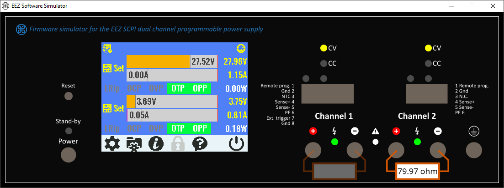
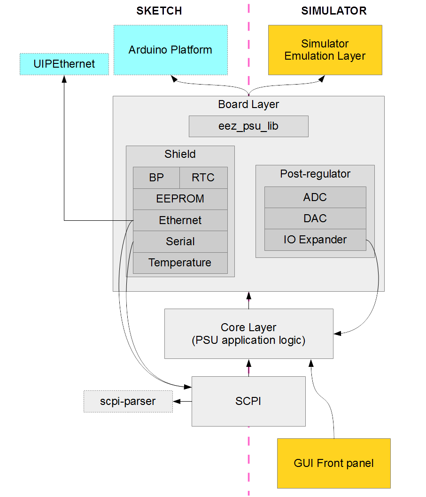
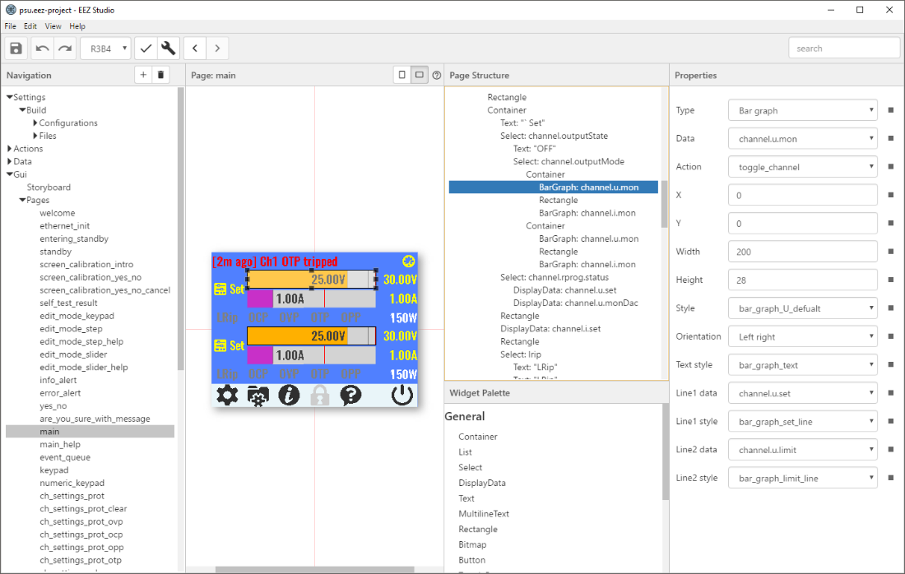

## Introduction

This project has Arduino/Genuino sketch for [Mega2560](https://www.arduino.cc/en/Main/ArduinoBoardMega2560) (8-bit, AVR)
and [Due](https://www.arduino.cc/en/Main/ArduinoBoardDue) (32-bit, ARM) boards and accompanying libraries for
the open hardware [EEZ H24005 power supply](http://www.envox.hr/eez/bench-power-supply/psu-introduction.html) firmware.

The unique feature of this project is a fully featured software simulator that can be used to evaluate all
firmware features without having physical power supply on disposal.
The simulator can be complied to run on major platforms such as Windows, Linux or Mac.
It shares all the code with the Arduino Sketch plus emulation layer for the Arduino API,
Ethernet library and digital controls used for programming and monitoring EEZ bench power supply.



Firmware key features:

- [SCPI 1999.0](http://www.ivifoundation.org/scpi/) command set for remote control over Serial (via USB) and TCP
- Multiple programmable channels
- Programming and continuous monitoring of voltage, current and power
- Voltage and current calibration
- Various protection mechanisms: OVP (Over Voltage Protection), OCP (Over Current Protection),
  OPP (Over Power Protection) and OTP (Over Temperature Protection)
- System date and time (using RTC)
- EEPROM based storage for device configuration, calibration parameters and 10 user profiles.
- Local GUI control using TFT touch display 
- Remote control based on SCPI protocol

### Ownership and License

The contributors are listed in CONTRIB.TXT. This project uses the GPL v3 license, see LICENSE.TXT.
EEZ psu-firmware uses the [C4.1 (Collective Code Construction Contract)](http://rfc.zeromq.org/spec:22) process for contributions..
To report an issue, use the [EEZ psu-firmware issue tracker](https://github.com/eez-open/psu-firmware/issues).

## Installation

### Arduino Sketch

We recommend Arduino IDE version 1.6.x or newer to compile and deploy Arduino sketch to the EEZ bench power supply.

1. Download zip archive from the github repository. 
2. Copy folders `eez_psu_sketch` and `libraries` from
the zip archive into Arduino folder on your computer. Arduino folder is e.g. `My Documents\Arduino` on Windows or `Documents/Arduino` on Linux and Mac. 
3. Open `eez_psu_sketch.ino` in Arduino IDE, check if
everything is correct with Verify button and upload the sketch using Upload button.
4. Remote control can be accessed via Telnet client such as [putty](http://www.chiark.greenend.org.uk/~sgtatham/putty/) (connection type: raw, port: 5025)
or serial client that comes with Arduino IDE or any other you like.

### Simulator

Here we will explain how to build simulator from source code on Windows, Linux and Mac.

If you are on Windows, there is a pre-build version:

[  ](http://www.envox.hr/eez/component/jdownloads/download/1-software-simulator-for-windows.html)

After you build and run simulator, a mouse is used as simulation of finger on the TFT touchscreen display.

Console window can be used to enter SCPI commands [SCPI reference manual](http://www.envox.hr/eez/bench-power-supply/psu-scpi-reference-manual/psu-scpi-introduction.html).
SCPI commands can be also send by starting a telnet session to the port 5025:

```
telnet localhost 5025
```

#### Windows

To build simulator from the source code you need Visual Studio 2015. You can use Community Edition which
is a free version of Visual Studio 2015. Visual Studio solution for the simulator is in
`simulator\\platform\\Win32\\eez_psu_sim.sln`. Open solution then build and execute simulator with `F5`.

#### Linux

Here are the steps to build simulator on Linux:

```
sudo apt-get install -y git libsdl2-dev libsdl2-image-dev libsdl2-ttf-dev
git clone https://github.com/eez-open/psu-firmware
cd psu-firmware/simulator/platform/linux/
make
```

Start simulator with:

```
./eez_psu_sim
```

Just as in case of Arduino sketch mentioned above that runs on real hardware you can access simulator using telnet client (use localhost or 127.0.0.1 for connection).

#### Mac

Mac users will require Brew for building. If you don't have it you can download and install it from [here](http://brew.sh/).

Here are the steps to build simulator on Mac:

```
brew install sdl2 sdl2_image sdl2_ttf
git clone https://github.com/eez-open/psu-firmware
cd psu-firmware/simulator/platform/linux/
make
```

Start simulator with:

```
./eez_psu_sim
```

Just as in case of Arduino sketch mentioned above that runs on real hardware you can access simulator using telnet client (use localhost or 127.0.0.1 for connection).

## Guide to the source code

### Architecture

EEZ bench power supply sketch source code can be divided into following layers:

- Board
  
  Talks directly to the hardware, i.e. [Arduino Shield +BP module](http://www.envox.hr/eez/bench-power-supply/psu-digital-control.html) (EEPROM, RTC, Ethernet, TLC5925) and [post-regulators](http://www.envox.hr/eez/bench-power-supply/psu-post-regulator.html) (ADC, DAC, IO Expander).
  Part of this layer is eez_psu_lib, a small Arduino library with [definition of all pins](http://www.envox.hr/eez/bench-power-supply/psu-digital-control/psu-arduino-shield-pin-mapping.html) used by EEZ bench power supply.
  This layer depends on Arduino platform API and third party UIPEthernet library.

- Core
  
  Implementation of EEZ bench power supply firmware functionality, for example Channel abstraction.
  It doesn't work directly with the hardware but uses the board layer, so it doesn't depends on Arduino platform API. 

- Control
  
  This layer is using Core layer to implement local and remote control.
  
  Local control is GUI based using TFT touch display. Special tool was developed to assist creation of GUI interface.
  This layer depends on third party library [UTFT_Pro](https://github.com/itead/ITEADLIB_Arduino_UTFT_Pro) library that we use to draw graphical primitives.
  
  Remote control is based on SCPI protocol. Check [SCPI reference manual](http://www.envox.hr/eez/bench-power-supply/psu-scpi-reference-manual/psu-scpi-introduction.html) for available commands.
  This layer depends on third party [scpi-parser](https://github.com/j123b567/scpi-parser) library.

Additionally, simulator introduces two additional layers:

- Simulator Emulation Layer

  This layer is simulator's replacement for the Arduino platform and consists of: 
  - Arduino platform API emulation.
  - [SPI](https://en.wikipedia.org/wiki/Serial_Peripheral_Interface_Bus) peripherals emulation.
  - UIPEthernet library emulation.

- GUI Front Panel

Communication between layers is unidirectional with some exceptions:

- Ethernet and Serial to SCPI.

  This is used to feed SCPI with the input received on serial and TCP port.

- IO Expander to Core.

  IO Expander interrupt handler sends GPIO register and ADC snapshot to the Core layer.  



### Board Layer

Here are the components of the board layer (all the files are in `eez_psu_sketch` folder):

- Arduino shield
    - Board (`board.cpp` and `board.h`)
        - Post-regulator (power channel) power up and down
        - LED's: CV and CC
    - BP (`bp.cpp` and `bp.h`)
        - LED's: standby, output and sense
    - Buzzer (`buzzer.cpp` and `buzzer.h`)
        - sound tone(frequency, duration) function
    - EEPROM (`eeprom.cpp` and `eeprom.h`)
        - read and write
    - Ethernet (`ethernet.cpp` and `ethernet.h`)
        - SCPI over TCP server on port 5025
        - Requires third party library [UIPEthernet](https://github.com/mvladic/arduino_uip/tree/Arduino_1.5.x)
    - RTC (`rtc.cpp` and `rtc.h`)
        - system date and time
    - Serial (`serial_psu.cpp` and `serial_psu.h`)
        - SCPI over Serial
        - Debug output
    - Temp. sensors (`temp_sensor.cpp` and `temp_sensor.h`)
        - MAIN temp. sensor read over analog pin
    - FAN control
- Post-regulator (power supply channel)
    - ADC (`adc.cpp` and `adc.h`)
        - Channel's ADC
    - DAC (`dac.cpp` and `dac.h`)
        - Channel's DAC
    - IOExp (`ioexp.cpp` and `ioexp.h`)
        - ADC interrupt
        - DP (down-programmer) disable
        - CC (Constant current) and CV (Constant voltage)
        - PWRGOOD
        - OE (output enable)

Arduino library `eez_psu_lib` is also a part of the board layer and it is located in `libraries\eez_psu_lib` folder.

### Core Layer

Here are some components of the core layer (all the files are in `eez_psu_sketch` folder):

- PSU (`psu.cpp` and `psu.h`)
    - power up
    - power down (stand-by mode)
    - reset
    - test
    - Update device related SCPI registers
- Channel (`channel.cpp` and `channel.h`)
    - set voltage and current
    - measure voltage and current
    - apply calibration parameters
    - output enable/disable
    - remote sensing enable/disable
    - DP enable/disable
    - OVP, OCP and OPP
    - Update channel related SCPI registers
- Calibration (`calibration.cpp` and `calibration.h`)
    - Calibration procedure
- Profile (`profile.cpp` and `profile.h`)
    - Save
    - Recall
- Temperature (`temperature.cpp` and `temperature.h`)
    - OTP
    - Measurement
- Date and time (`datetime.cpp` and `datetime.h`)
    - Set system datetime
    - Check the validity of datetime
    - Store datetime persistently in EEPROM
- Debug (`debug.cpp` and `debug.h`)
    - Debugging helper functions
- Util (`util.cpp` and `util.h`)
    - Miscellaneous functions
- Sound (`sound.cpp` and `sound.h`)
    - Beep
    - Power up and power down (stand-by) tunes
- Persistent configuration (`persist_conf.cpp` and `persist_conf.h`)
    - Store/restore persistent configuration

### Control Layer

#### Local control: TFT touch GUI

Implementation of the GUI is based on MVC (Model View Controller) architecture.

In MVC architecture, **Model** is where all the data that is displayed on the screen comes from and our Model is implemented in the Core layer.

**View** defines how everything looks on the screen. In our case, View is defined declaratively and definitions are created with the special tool we call EEZ Studio (it is not public yet!).



This tool creates JSON based eez-project file which contains definitions of GUI pages, styles, bitmaps and fonts along with
data and action definitions.
JSON file is then compiled to C++ source code files (`gui_document.cpp`, `gui_document.h`, `actions.cpp` and `actions.h`)
that are included as an integral part of the sketch.

**Controller** is the glue code between Model and View. It is implemented in the all the files that start with "gui_" prefix. 

Also, there is some utility code that is used, for example, to interact with the hardware:

- `lcd.cpp`, `lcd.h` and UTFT_Pro is used to draw graphical primitives on the screen.
- `touch.cpp` and `touch.h` is used to get data from the touch hardware. Input from the touch hardware is filtered using `touch_filter.cpp` and `touch_filter.h` - check [this](https://www.youtube.com/watch?v=jofIdGx2gTg) and [this](https://www.youtube.com/watch?v=_mrBomMLKiI) video. 
- `font.cpp` and `font.h` is used to to access font definitions created with EEZ Studio.  

#### Remote control: SCPI

We are using [third party SCPI parser](https://github.com/j123b567/scpi-parser) and have our [own branch](https://github.com/mvladic/scpi-parser) where command definitions could be in AVR PROGMEM that helps preserve some memory space when Arduino Mega board is used.
(check [avr_progmem](https://github.com/mvladic/scpi-parser/tree/avr_progmem) branch). 

There are two entry points for the SCPI commands: serial port and TCP server.
Check `serial_psu.cpp` and `serial_psu.h` to see how SCPI commands are received
on serial port, and `ethernet.cpp` and `ethernet.h` for the TCP server.

Files `scpi_psu.cpp` and `scpi_psu.h` are about SCPI parser initialization and input handling.
Also, here is defined the scpi_psu_t structure for storing SCPI parser context data specific to EEZ bench power supply.

Parameter types that are repeatedly used in multiple commands (like channel number) are handled
in `scpi_params.cpp` and `scpi_params.h`.

Registers are set/get in `scpi_params.cpp` and `scpi_params.h`.

All other files that starts with `scpi_` in `eez_psu_sketch/` directory are about implementing
various SCPI commands. Every SCPI subsystem (like APPLy, SOURce, MEASure, SYSTem, etc.) has its
own pair of scpi_<subsys>.cpp and scpi_<subsys>.h files.

### Simulator Emulation Layer

#### Arduino API Emulation

We emulate only what we use:

- `pinMode`, `digitalRead`, `digitalWrite`, `analogRead`, `analogWrite`
- `digitalPinToInterrupt`, `attachInterrupt`
- `tone`
- `millis`, `micros`, `delay`, `delayMicroseconds`
- `Serial`
- `SPI`

Check the files `Arduino.h`, `arduino_impl.cpp`, `arduino_impl.h`, `SPI.h` from the `simulator\src\arduino` folder.

For the `tone` function we have two different implementations:
- for the Win32 platform in file `simulator\platform\win32\eez_psu_sim\tone.cpp`
- and for the Linux and Mac platform in file `simulator\platform\linux\src\tone.cpp`

#### SPI peripherals

The following devices are controlled via SPI bus:

- [ADS1120](http://www.ti.com/product/ADS1120) for 15-bit ADC
- [DAC8552](http://www.ti.com/product/DAC8552) for 16-bit DAC
- [MCP23S08](https://www.microchip.com/wwwproducts/Devices.aspx?product=MCP23S08) for I/O 8-bit Expander
- [ENC28J60](https://www.microchip.com/wwwproducts/Devices.aspx?product=ENC28J60) for Ethernet
- [AT25256B](http://www.atmel.com/devices/at25256b.aspx) for 256kb EEPROM
- [PCA21125](www.nxp.com/documents/data_sheet/PCA21125.pdf) for RTC
- [TLC5925](http://www.ti.com/product/TLC5925) for BP (Binding Posts) option

These peripherals are emulated in simulator, check the files `chips.cpp` and `chips.h` in `simulator/src/chips`.

#### UIPEthernet Emulation

UIPEthernet library interface is defined in files `UIPClient.h`, `UIPEthernet.h` and `UIPServer.h`;
this interface is is implemented in file uipethernet_impl.cpp and this implementation is based on
platform interface defined in ethernet_platform.h. There are two implementations of this platform interface:

- for the Win32 platform in file `simulator\platform\win32\eez_psu_sim\ethernet_win32.cpp`
- and for the Linux and Mac platform in file `simulator\platform\linux\src\ethernet_linux.cpp`

### Simulator GUI Front Panel

Implementation files are in `simulator/src/front_panel`.

Implementation is using `eez_imgui` dynamic library.

This library is dynamically loaded at runtime, so that simulator can run even if this library is missing (check the `simulator/src/dll.h` for platform independent dynamic library loading).

`eez_imgui` library is very simple [immediate mode](http://www.cse.chalmers.se/edu/year/2011/course/TDA361/Advanced%20Computer%20Graphics/IMGUI.pdf)
GUI library that supports top level window with following widgets:

- Image
- On/off image (displays different images depending on boolean flag)
- Text
- Button

It is based on [SDL](https://www.libsdl.org/index.php), [SDL Image](https://www.libsdl.org/projects/SDL_image/)
and [SDL TTF](https://www.libsdl.org/projects/SDL_ttf/).